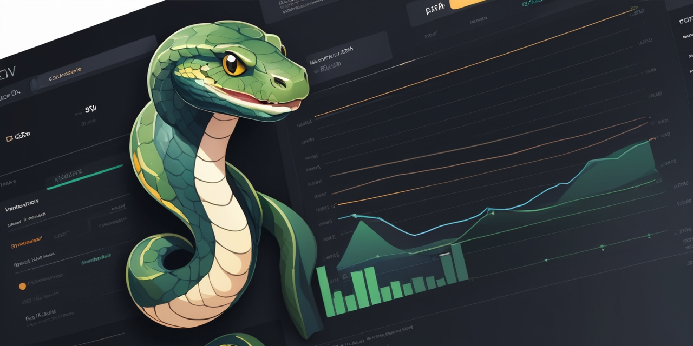

# Python Streamlit Dashboard Demo

Welcome to the Python Streamlit Dashboard Demo repository!

This web dashboard application was developed as a test and learning case for using Python, Pandas, Streamlit and Plotly Express,
to read and display supermarket sales data csv report, into custom metrics chart and pie graphs.



## Features

- Import CSV file data into dataframe.
- Display data grouped by selected year-month.
- Display graphs filtering by Invoicing, Product Invoicing, Store Invoicing, Payment method, Rating.

## Installation
1. Clone this repository to your local machine:
    
    ```
    git clone https://github.com/romuloParmeggiani/DashboardSTDemo
    ```

2. Enter the Project directory:

   ```
   cd DashboardSTDemo
   ```

3. Install required libraries:
    ```
   pip install -r requirements.txt
   ```

## Usage

1. Run the application:

    ```
    streamlit run main.py
    ```

2. From left-hand side menu, select desired year-month date to display.

## Contributing

Contributions are welcome!
If you'd like to add new features, improve existing ones, or fix any issues, feel free to open a pull request.

## Acknowledgements

Special thanks to [Rodrigo Vanzelotti](https://www.linkedin.com/in/rodrigovanzelotti/) for the clear instructions and explanations to develop this dashboard application.